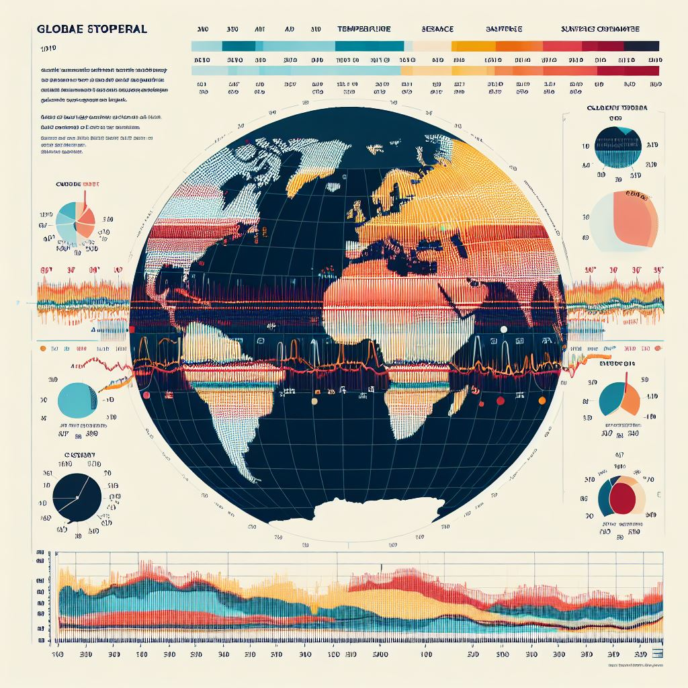

# globallandsurfacetemperatures_analysis
<html>

<h1>World Surface Temperature Analysis</h1>

  We analysed the dataset "climate changes on earth" and the dataset is from kaggle.com
  <b>GlobalLandTemperature in Country</b>
1. To know the avg temperature for different countries by a period of [25years].
2. Which country has highest mean temperature till last?
3. Which country has lowest mean temperature till last?
4. In a country to know the mean temperatures by months (mean of months in every year).

</html>
